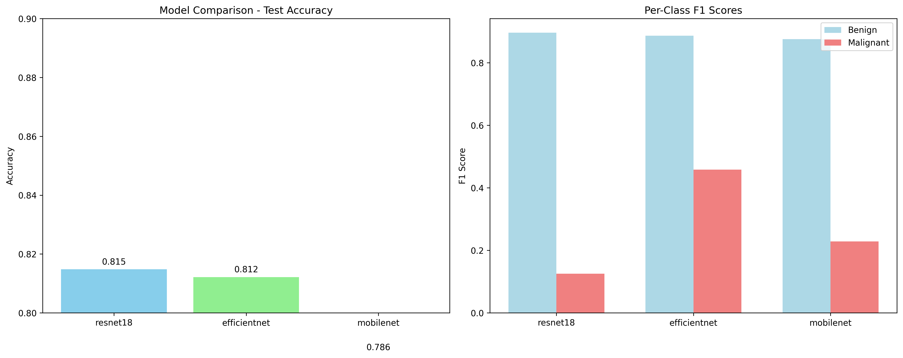
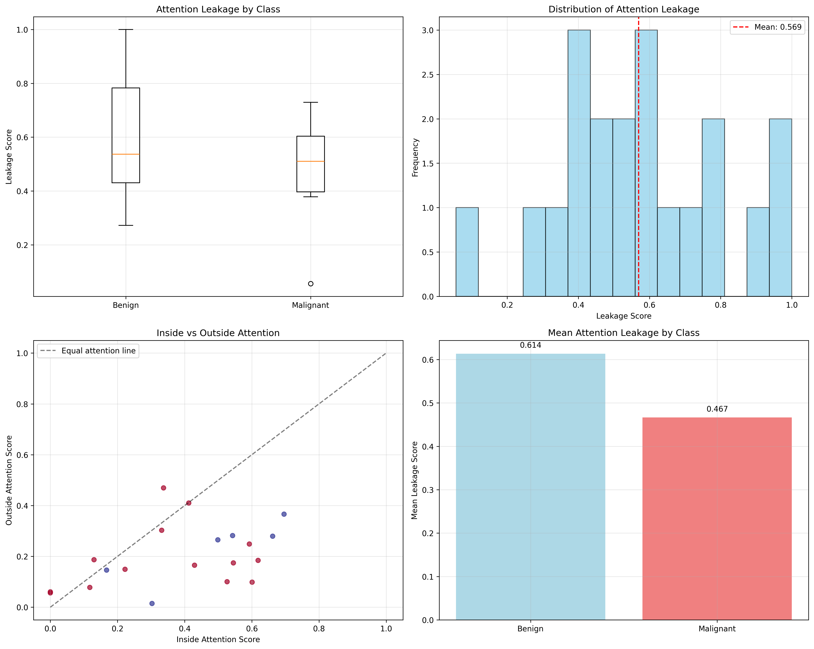

# Skin Lesion Classification with Attention Leakage Analysis

A comprehensive comparative study of CNN architectures for skin lesion classification using quantitative attention analysis using Grad-CAM and segmentation masks.

## Overview

This project implements and compares three fine-tuned CNN models (ResNet18, EfficientNet-B0, MobileNet-V2) for binary skin lesion classification. We use an attention leakage metric that quantifies how much model attention falls outside clinically relevant lesion regions, providing insights into model interpretability for medical AI applications.

## Key Features

- **Multi-model comparison** with comprehensive per-class evaluation
- **Attention leakage analysis** using segmentation masks
- **Quantitative interpretability metrics** for medical AI deployment

## Results

### Model Performance

| Model | Accuracy | Benign F1 | Malignant F1 |
|-------|----------|-----------|--------------|
| ResNet18 | 0.815 | 0.878 | 0.439 |
| **EfficientNet-B0** | **0.812** | **0.879** | **0.461** |
| MobileNet-V2 | 0.786 | 0.870 | 0.479 |

### Attention Leakage Analysis

Our quantitative analysis of attention leakage using segmentation masks to measure how much model focus falls *outside* the lesion provides several insights:

- **Mean attention leakage for benign lesions:** 61.4%
- **Mean attention leakage for malignant lesions:** 46.7%

- On average, the model’s attention is better aligned with the lesion for malignant cases, suggesting clinically relevant feature learning and reduced distraction from irrelevant background.
- Benign cases display higher leakage, which may reflect lower visual distinctiveness or biases toward normal skin context.
- Lower leakage for malignant lesions supports model trustworthiness for critical diagnostic use.
- This aligns with both improved F1-scores for malignant cases and the visual confirmation from attention overlays.

## Visualizations

### Model Comparison

### Attention Leakage Analysis

## Installation

pip install -r requirements.txt

## Dataset Setup

Download the ISIC 2016 Challenge Part 3B dataset and store it in the main directory.

## Usage

**Train and compare models:**
python skin_lesion_analysis.py

**Run attention leakage analysis:**
python gradcam_analysis.py

## Technical Details

- **Architecture**: Transfer learning with ImageNet pretrained weights
- **Training**: Adam optimizer, ReduceLROnPlateau scheduler, early stopping
- **Evaluation**: Stratified train/test split, comprehensive per-class metrics
- **Interpretability**: Grad-CAM with quantitative segmentation correlation
